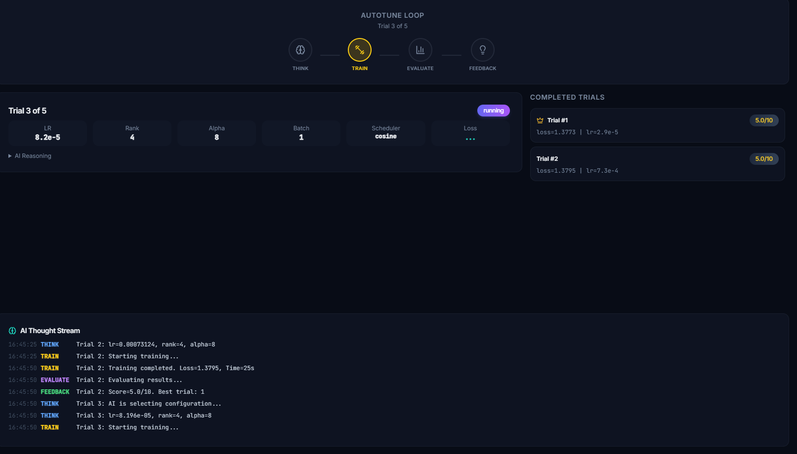
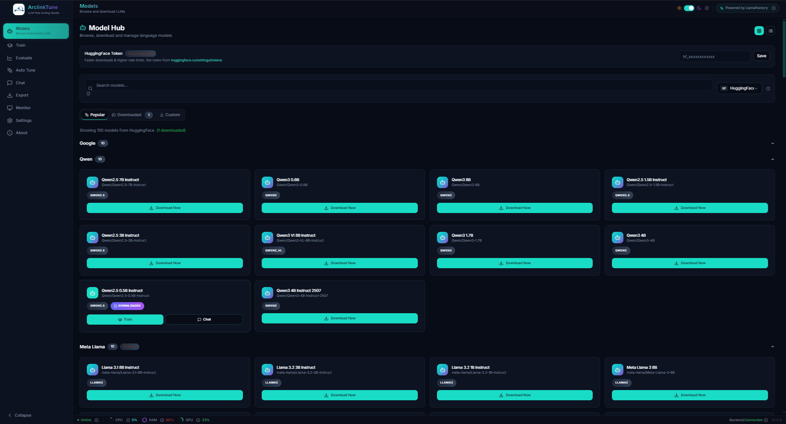
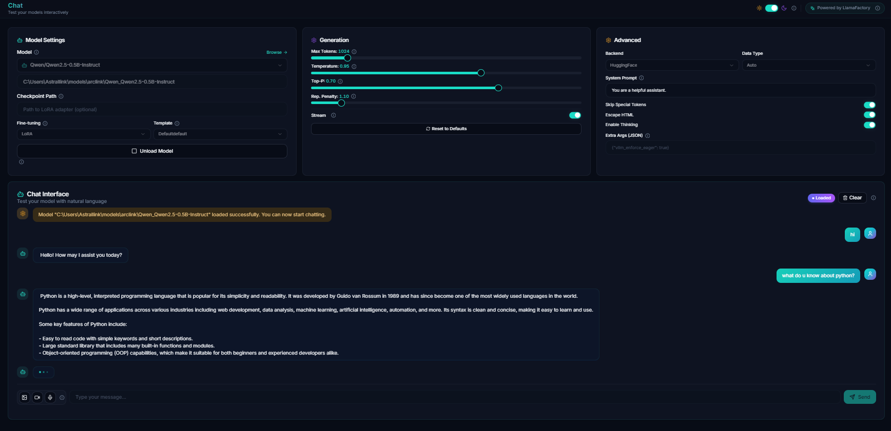
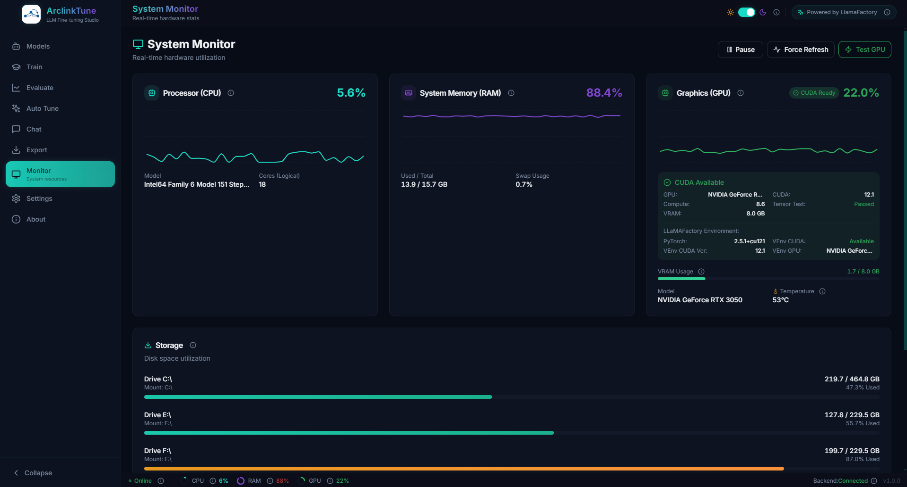
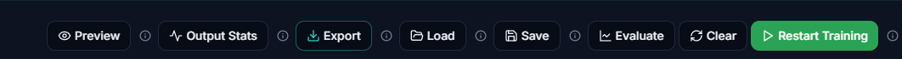
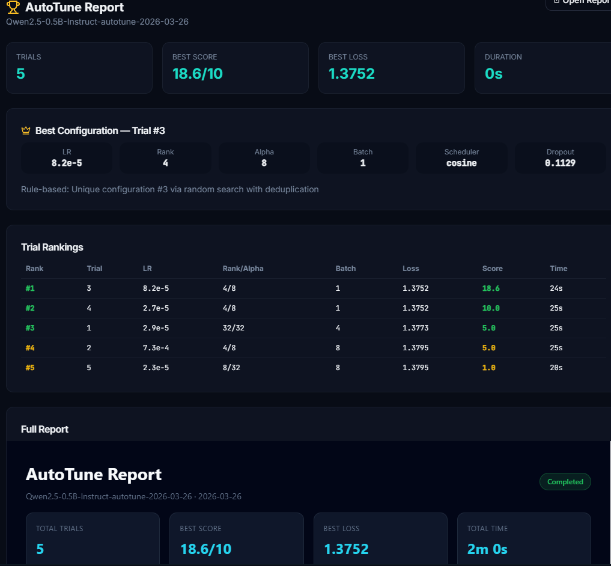

<div align="center">
  
</div>

# ArclinkTune


## 🌟 Revolutionizing LLM Fine-tuning

ArclinkTune is an advanced desktop application designed for LLM model management, fine-tuning, and inference. It introduces a revolutionary **AI-Powered Auto-Tuning** engine that automates hyperparameter optimization, making expert-level model specialization accessible to everyone.

### ✨ Key Features

- **AI Auto-Tuning (Core Innovation)**: An original engine that uses AI (Gemini/Ollama) to autonomously "think," "train," "evaluate," and "refine" your models' training parameters.
- **Model Management**: Seamlessly browse, download, and manage open-source models from Hugging Face and ModelScope.
- **Fine-Tuning**: Advanced support for LoRA and full fine-tuning with a simple, intuitive interface.
- **Real-time Monitoring**: Beautiful, live dashboards for GPU, CPU, and RAM usage.
- **Interactive Chat**: Test your trained models immediately with a built-in chat interface.
- **Evaluation**: Measure model performance with built-in benchmarks and automated reporting.
- **Export**: Export your specialized models in various formats for easy deployment.

## 🖼️ Gallery

| Feature | Screenshot |
|---------|------------|
| **Auto-tuning Interface** |  |
| **Model Management** |  |
| **Chat Interface** |  |
| **System Monitoring** |  |
| **Training Results** |  |
| **AI Evaluation Report** |  |

## 🏗️ Architecture

ArclinkTune uses a unified environment for training and monitoring:

```
┌─────────────────────────────────────────────────────────────┐
│                    ArclinkTune Architecture                   │
├─────────────────────────────────────────────────────────────┤
│                                                             │
│   ┌─────────────────┐    ┌─────────────────┐               │
│   │     Frontend    │    │     Backend     │               │
│   │   (Electron)    │───▶│    (FastAPI)    │               │
│   │  localhost:5173 │    │  localhost:8000  │               │
│   └─────────────────┘    └────────┬────────┘               │
│                                    │                        │
│                                    ▼                        │
│   ┌─────────────────────────────────────────────────────┐   │
│   │              core\.venv (Virtual Env)                │   │
│   │  • LlamaFactory (llamafactory-cli)                  │   │
│   │  • PyTorch with CUDA (GPU training/inference)       │   │
│   │  • PyTorch for GPU Monitoring                       │   │
│   │  • pynvml (NVIDIA GPU stats)                       │   │
│   └─────────────────────────────────────────────────────┘   │
│                                                             │
└─────────────────────────────────────────────────────────────┘
```

### Environment Details:

| Component | Python Environment | Purpose |
|-----------|-------------------|---------|
| **Training** | `core\.venv` | LlamaFactory, model training, fine-tuning |
| **Inference** | `core\.venv` | Chat API, model loading |
| **GPU Monitoring** | `core\.venv` | PyTorch CUDA, pynvml, real-time stats |
| **Frontend** | Node.js | Electron app, React UI |

### Key Ports:

| Service | Port | Purpose |
|---------|------|---------|
| Backend API | 8000 | FastAPI server |
| Frontend | 5173 | React dev server |
| Chat API | 8001 | LLaMA-Factory inference (internal) |

## Project Structure

```
ArclinkTune/
├── app/                    # Electron + React frontend
├── backend/                # FastAPI backend
├── core/                   # Python Virtual Env + LlamaFactory
├── scripts/                # Launcher and utility scripts
├── Public/                 # Application screenshots
└── README.md
```

## 🚀 Quick Start

### First Time Setup (run once)

```powershell
# PowerShell
.\scripts\setup.ps1

# Or Command Prompt
scripts\setup.bat
```

### Run the App (every time)

```powershell
# PowerShell
.\scripts\run.ps1

# Or Command Prompt
scripts\run.bat
```

## 🛠️ Contributing

We welcome contributions! Please see our [CONTRIBUTING.md](CONTRIBUTING.md) for guidelines. 

**Note**: The AI-driven auto-tuning logic is a completely original idea and implementation. While we use LlamaFactory as the training engine, the intelligent optimization layer is unique to this project.

## 📄 License

ArclinkTune is licensed under the **PolyForm Noncommercial License 1.0.0**. 

- **Personal & Academic Use**: Completely free.
- **Enterprise & Commercial Use**: Prohibited without a separate commercial agreement.

See the [LICENSE](LICENSE) file for more details.

---

## Acknowledgments

- [LlamaFactory](https://github.com/hiyouga/LlamaFactory) - Training framework
- [Electron](https://electronjs.org/) - Desktop framework
- [FastAPI](https://fastapi.tiangolo.com/) - Backend framework
- [shadcn/ui](https://ui.shadcn.com/) - UI components
